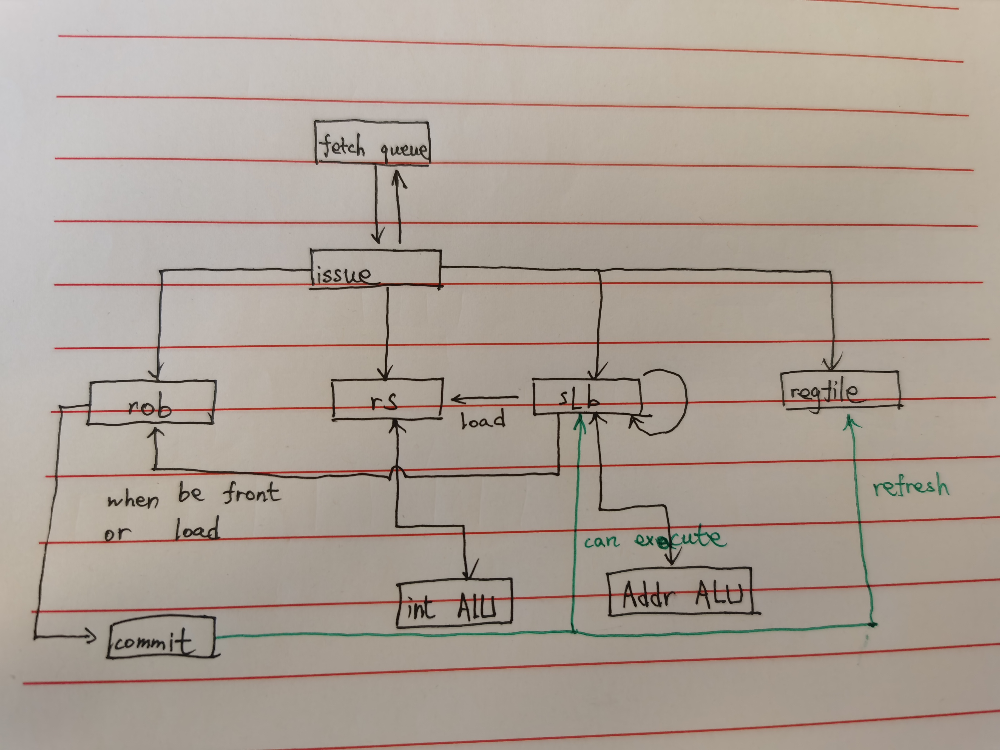

# RISC-V-simulator-Tomasulo
A simple CPU simulator with Tomasulo

## 逻辑图

## 关于分支预测

使用二位饱和计数器。预测的准确率如下：

| 测试点         | 跳转总数 | 成功预测数 | 成功率  |
| -------------- | :------: | :--------: | :-----: |
| array_test1    |    22    |     10     | 45.45%  |
| array_test2    |    26    |     12     | 46.15%  |
| basicopt1      |  155139  |   84352    | 54.37%  |
| bulgarian      |  71493   |   33692    | 47.13%  |
| expr           |   111    |     65     | 58.56%  |
| gcd            |   120    |     51     | 42.50%  |
| hanoi          |  17457   |    8731    | 50.01%  |
| lvalue2        |    6     |     4      | 66.67%  |
| magic          |  67869   |   29575    | 43.58%  |
| manyarguments  |    10    |     4      | 40.00%  |
| multiarray     |   162    |    132     | 81.48%  |
| naive          |    0     |     0      | 100.00% |
| pi             | 39956380 |  22879591  | 57.26%  |
| qsort          |  200045  |   136166   | 68.07%  |
| queens         |  77116   |   35856    | 46.50%  |
| statement_test |   202    |    109     | 53.96%  |
| superloop      |  435027  |   370233   | 85.11%  |
| tak            |  60639   |   15162    | 25.00%  |
